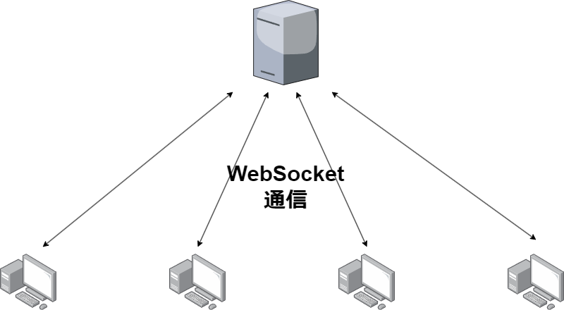
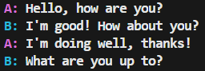
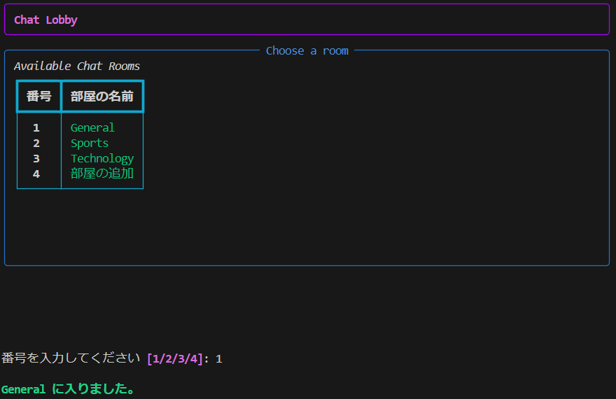

# TerminalChatTool

## Abstract

ターミナル上でユーザーを指定,もしくはオープンな場でチャットできるツール

## Protocol

サーバーとの通信は WebSocket 通信を用いて行う



## Data

以下のような JSON 形式を server に送信 server 側でどのユーザーに送るかを判断する

```json
{
    "id" : uuid,
    "name" : user_name,
    "message" : text_message
}
```

# Env

## Lang

Python 3.11

### Library

CUI : `rich`

Server : `flask`, `flask_socketio`

Client : `socketio`

# Client image

### チャット画面



### 部屋選択画面



# Server Protocol

イベント名で管理する
`message`, `connect`, `disconnect`, `create_room`, `exit_room`等
