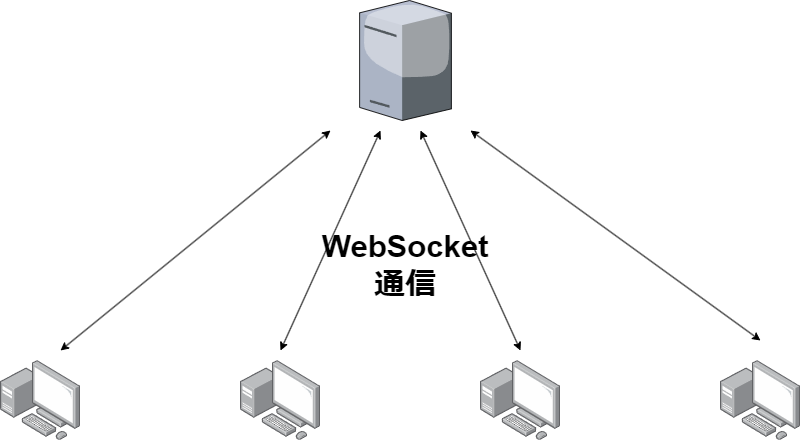

# TerminalChatTool

## Abstract

ターミナル上でユーザーを指定,もしくはオープンな場でチャットできるツール

## Protocol

サーバーとの通信は WebSocket 通信を用いて行う



## Data

以下のような JSON 形式を server に送信 server 側でどのユーザーに送るかを判断する

```json
{
    "id" : uuid,
    "name" : user_name,
    "message" : text_message
}
```
